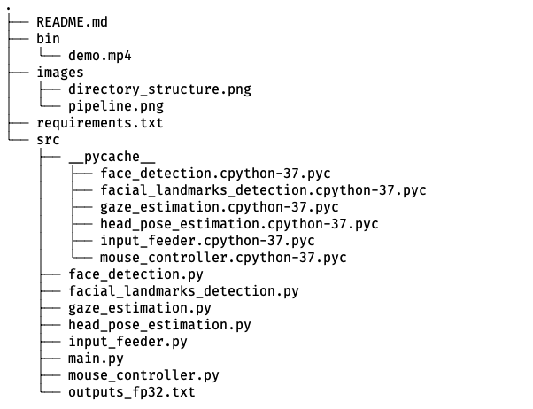
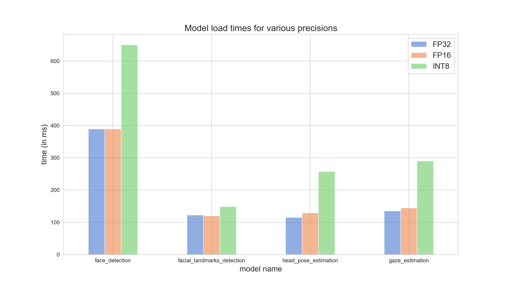
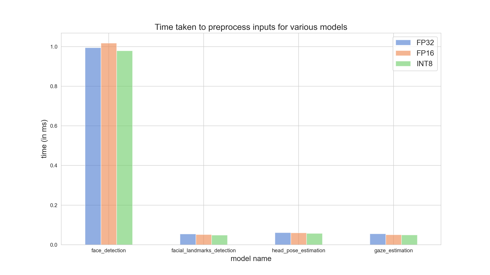
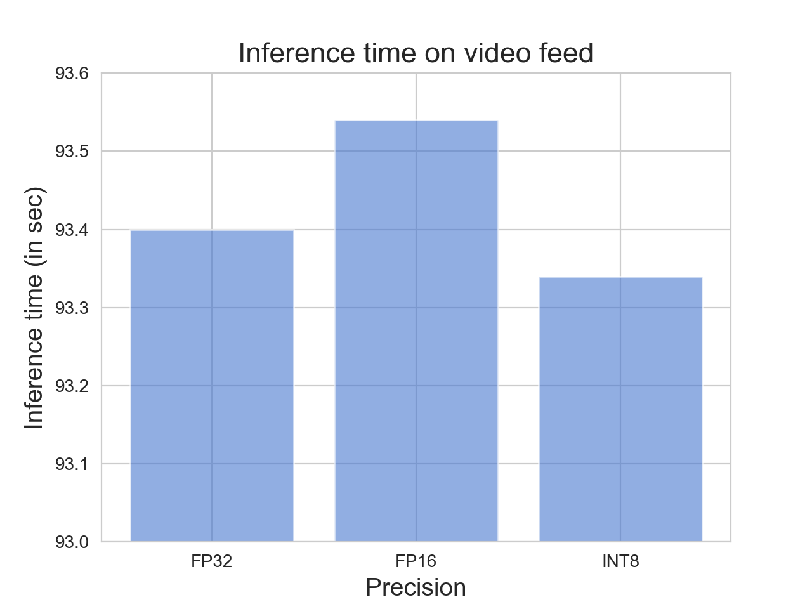
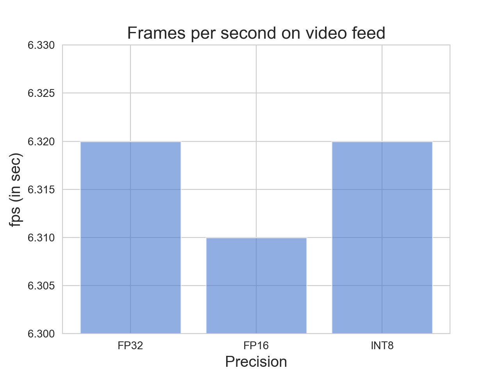

# Computer Pointer Controller
This project is the part of Intel Edge AI for IoT developers nanodegree of Udacity. It 
uses a person's gaze to control the mouse pointer to move in that direction. It can be used on a live video feed from webcam or a video stream. The project itself uses 4 different models and Gaze detection is one of the models which lies on the top of the model stack.

## Project Set Up and Installation
### Set up locally
Following is the step-by-step instructions to run the application:
1. Download and install __Intel OpenVINO toolkit__. The detailed instructons for installation can be 
found [here](https://docs.openvinotoolkit.org/latest/index.html)
2. Create a virtual environment using either [anaconda](https://docs.conda.io/projects/conda/en/latest/user-guide/tasks/manage-environments.html#creating-an-environment-with-commands) or [virtualenv](https://docs.python.org/3/library/venv.html#creating-virtual-environments)
3. Source the OpenVINO environment using: `source /opt/intel/openvino_2020.2.117/bin/setupvars.sh -pyver 3.7` where the flag `pyver` is optional 

(Note: Python version 3.5+ is required and openvino version 2020.x.xxx (preferably))

4. Download all the starter files. These can be downloaded from [here](https://video.udacity-data.com/topher/2020/April/5e974e37_starter/starter.zip). Once downloaded, unzip the files in the project directory
5. Download the required models from OpenVINO model zoo. The models we will be using are:
    * [Face Detection](https://docs.openvinotoolkit.org/latest/omz_models_intel_face_detection_adas_binary_0001_description_face_detection_adas_binary_0001.html)
    * [Facial Landmarks Detection](https://docs.openvinotoolkit.org/latest/_models_intel_landmarks_regression_retail_0009_description_landmarks_regression_retail_0009.html)
    * [Head Pose Estimation](https://docs.openvinotoolkit.org/latest/_models_intel_head_pose_estimation_adas_0001_description_head_pose_estimation_adas_0001.html)
    * [Gaze Estimation](https://docs.openvinotoolkit.org/latest/_models_intel_gaze_estimation_adas_0002_description_gaze_estimation_adas_0002.html)

(Downloading the models from command line for different precision values is discussed in the next section.)

6. Download all the files to your local machine

(NOTE: It's not trivial to git clone only this project since it's a subdirectory of a github repository, so you might have to download all the files)

7. Once the models are downloaded, we need to create python scripts for each of the four models for preprocessing and making inferences. This is because each model has different set of requirements. These scripts are listed in [src](src/) directory.
The entire directory structure for the project is like this:


- [`images`](images/) (_dir_): contains all the project metadata like the images
- [`bin`](bin) (_dir_): contains the video file `demo.mp4` on which the application is run
- [`requirements.txt`](requirements.txt)(_file_): file containing list of the important packages required for running this project
- [`src`](src)(_dir_): contains all the source code for this project
    - [`face_detection.py`](src/face_detection.py): contains `FaceDetection` class which has methods for loading the face detection model, preprocessing the inputs, making inferences and processing the outputs which are the face images of person
    - [`facial_landmarks_detection.py`](src/facial_landmarks_detection.py): this script contains `FacialLandmarksModel` class which uses the output from `face_detection.py` script as input, loads the landmark detection model, makes inferences and finally processes the outputs. It outputs the coordinates and the images of left and right eyes of person in the video frame
    - [`head_pose_estimation.py`](src/head_pose_estimation.py): similar to `facial_landmarks_detection.py`, this script also uses the output of face detection model as input and outputs three angles - yaw, pitch and roll which constitutes the head position of the person in video frame
    - [`gaze_estimation.py`](src/gaze_estimation.py): for the purpose of running this script, we had to run all above scripts since it takes person's eyes and head poses as inputs. It then outputs the gaze vector of the person from which the _x_ and _y_ coordinates for mouse pointer can be extracted
    - [`input_feeder.py`](src/input_feeder.py): it initializes the videocapture with appropriate input ("CAM", video or image) and then start the pipeline by returning the frames in batches for inferencing
    - [`mouse_controller.py`](src/mouse_controller.py): contains class for controlling the mouse pointer
    - [`main.py`](src/main.py): the main script which wraps all the above modules together and runs the application

## Demo
### Downloading the pre-trained models
- Activate the environment for the project
- Do `source /opt/intel/openvino_2020.2.117/bin/setupvars.sh -pyver 3.7` 
- Change the directory to:
`cd /opt/intel/openvino/deployment_tools/tools/model_downloader`
- __For Face Detection model, run the following python script with the given flags:__
```
python downloader.py --name face-detection-adas-binary-0001 -o <path_to_the_project_directory>

or 

python downloader.py --name face-detection-adas-0001 -o <path_to_the_project_directory>
```
flag `-o` refers to the path where the model should be downloaded.

> __`face-detection-adas-binary-0001` model is available in only one precision (FP32), so I used `face-detection-adas-0001` model which offers (FP32, FP16, INT8) precision values. Different precision values are needed for benchmarking the models. I double checked and both the models performed exactly the same.__

- __Facial landmarks detection model__
```
python downloader.py --name landmarks-regression-retail-0009 -o <path_to_the_project_directory>
```
- __Head pose estimation model__
```
python downloader.py --name head-pose-estimation-adas-0001 -o <path_to_the_project_directory>
```
- __Gaze estimation model__
```
python downloader.py --name gaze-estimation-adas-0002 -o <path_to_the_project_directory>
```
- __Running Application__

To run the application, execute the following command from the root directory (for FP32 precision)
```
python src/main.py --input_path bin/demo.mp4 --face_detection $MODEL_DIR/face-detection-adas-binary-0001/FP32-INT1/face-detection-adas-binary-0001 --facial_landmarks $MODEL_DIR/landmarks-regression-retail-0009/FP32/landmarks-regression-retail-0009 --head_pose $MODEL_DIR/head-pose-estimation-adas-0001/FP32/head-pose-estimation-adas-0001 --gaze $MODEL_DIR/gaze-estimation-adas-0002/FP32/gaze-estimation-adas-0002 --visualize fd fld hpe --device CPU --output_fname outputs_fp32
```

## Documentation

__Description of various command line arguments and shell variables used:__
- `MODEL_DIR`: shell variable for the path to the directory which contains all the models
- `--input_path`: path to the input file or "CAM" for webcam
- `--face_detection`: path to face detection model
- `--facial_landmarks`: path to facial landmarks detection model
- `--head_pose`: path to head pose estimation model
- `--gaze`: path to gaze estimation model
- `--visualize`: flag for outputting the video with given bounding boxes based on the arguments parsed: 
    * `fd`: bounding box only around the face of the person
    * `fld`: bounding boxes around both the eyes of the person
    * `hpe`: diplays the three head pose angles on the frame
    
    (Note: Combination of above arguments can also be used)
- `--device`: flag parses the device name on which inference is being run. Default device is "CPU", other devices like "GPU", "FPGA", "MYRIAD" can also be passed.

(Note: OpenVINO version 2020.x.xxx does not require any cpu extension files)
- `--output_fname`: path to the output file which stores the stats for the model for a given precision, default value: `outputs_fp32`, other values can be `outputs_fp16` and `outputs_int8`


### Project Pipeline
The overall flow of data through the model looks like:


## Benchmarks

All the benchmark tests are performed on 5th generation Intel Core(TM) i7-5557U processor with 16GB of RAM with Intel OpenVINO toolkit version 2020.2.117.

Due to the lack of different hardwares, most of the benchmarks are performed on CPU for various precisions. Various benchmarks are considered like:
- Model load time

- Input preprocessing time

- Inference times

- Frames per second


## Results
Ofcourse, using different hardwares would have provided us more insights like the best hardware for this application. But still a few important things can be inferred from above plots:
- `INT8` has the worst model load times across all the models used, this might be because CPUs are not optimized to use with this precision
- `face_detection` model is the biggest bottleneck when it comes to loading the model and preprocessing the input for the inference. It will effect the overall model performance but for standalone inference, it will not change much. So, optimization techniques like reducing model size might help. Although from the plot for model load times above, we see that reducing precision from FP32 to FP16 didn't change model load time at all. This means quantization won't be of much use here but we can try techniques like model compression, and weight sharing
- Inference times and frames per second stayed more or less the same across all the precisions. These metrics are the areas which can be further explored using different hardwares like we saw in project-2 of this nanodegree

## Stand Out Suggestions
- The main suggestion which might set this project apart is to use different hardwares but limited time and resources led me to use only CPU
- Like mentioned before, face detection model is the biggest bottleneck. So different model optimization techniques like reducing the number of weights, etc. can be used which will minimize the time taken to load the model
- We can find hotspots in the model using VTune amplifier which, although won't be very useful in our case since inference time stayed almost the same for all the precision

### Edge Cases
- The backbone of this project is to detect the person's face first. The inference might give us unexpected results if it detects more than one face in the frame 
